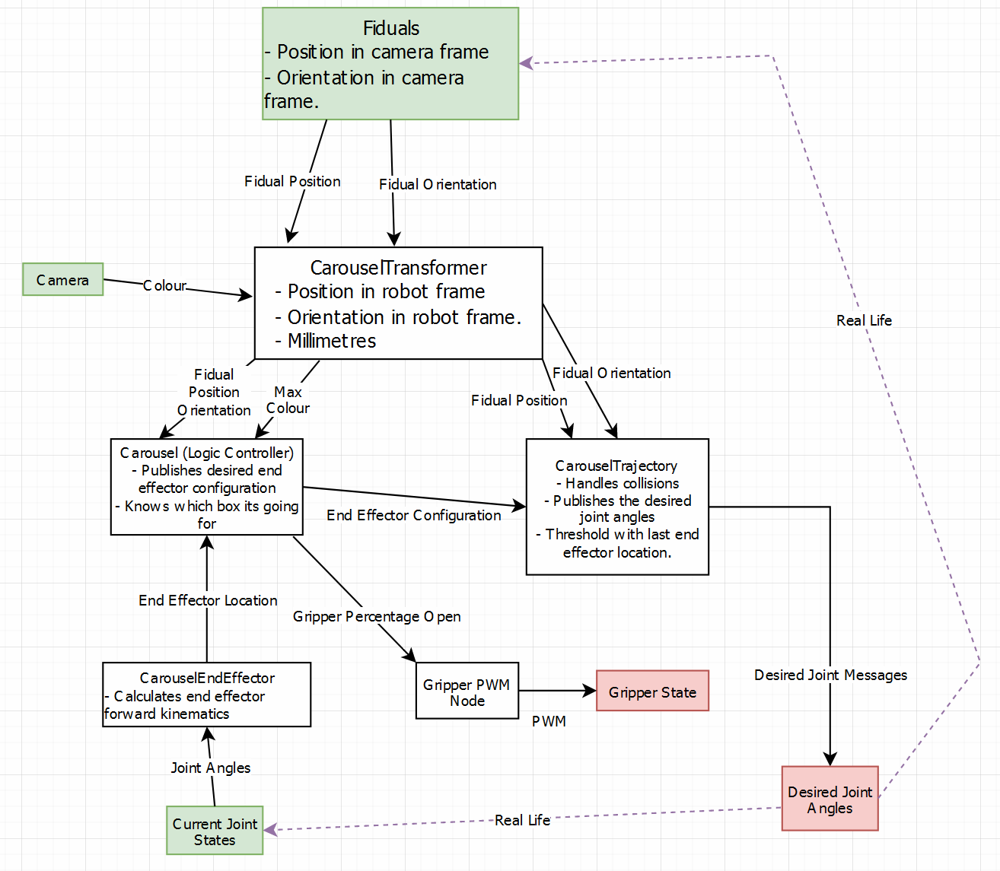

# Meeting Notes

## 8/9/2022 @ 8:00am

Input / Output of the system
- Input:
  - From the camera ros nodes and the dynamixel joint nodes we can determine the current configuration of the robot.
  - `JointState` velocities, positions, and torque (from milliamps).
  - Position and orientation of the boxes in space.
- Output:
  - The desired `JointState` positions, velocities and torque.

Want to get to the output configuration with the gripper above the cube. We know the current orientation of every joint of the cube. Pickup the cube. Transform to configuration to the dropoff point.

State machine for logic controller?

The camera is located above of the whole system.

Camera provides entire 3D pose (position and orientation) of each cube at all times, and the id of each code.

References
- Camera
    - [aruco_detect](http://wiki.ros.org/aruco_detect) / [fiducials](http://wiki.ros.org/fiducials) / [Detection](https://docs.opencv.org/3.1.0/d5/dae/tutorial_aruco_detection.html)
    - [Python Dynamixel Slider Example](https://github.com/UQ-METR4202/dynamixel_slider/blob/master/slider_publisher)
- Motors
    - [Dynamixel Interface](https://github.com/UQ-METR4202/dynamixel_interface/blob/master/tutorials/tutorial_1_using_the_controller.md)
    - [JointState](https://docs.ros.org/en/lunar/api/sensor_msgs/html/msg/JointState.html)


The `JointState` published by the dynamixel / sent for desired `JointState`:
```
This is a message that holds data to describe the state of a set of torque controlled joints. 

The state of each joint (revolute or prismatic) is defined by:
  * the position of the joint (rad or m),
  * the velocity of the joint (rad/s or m/s) and 
  * the effort that is applied in the joint (Nm or N).

Each joint is uniquely identified by its name The header specifies the time at which the joint states were recorded. All the joint states in one message have to be recorded at the same time.

This message consists of a multiple arrays, one for each part of the joint state.  The goal is to make each of the fields optional. When e.g. your joints have no
effort associated with them, you can leave the effort array empty. 

All arrays in this message should have the same size, or be empty. This is the only way to uniquely associate the joint name with the correct
states.

Header header

string[] name
float64[] position
float64[] velocity
float64[] effort

For example:
  name: ['joint_1', 'joint_2']
  position: [0.0000, 0.0000]
  velocity: [0.0000, 0.0000]
  effort: [0.0000, 0.0000]
```
TODO:
- Create a node for determining the end effector configuration of the robot.
  - Create an PoE model for the robot.
  - Implement a PoE node that takes the angles of the joints and publishers the end effecor position.
- Create a logic node for determining the desired angles and what to do next.
- Create an inverse kinematics node for determining the desired angles and trajectory.

## 23/9/2022 @ 6:00pm

Required to determine input and output of the system to determine what data we have access to, any preliminary data cleaning and what data we have to publish.

Need to know orientation so that the end effector can grip the box. Wait for the box to rotate around the conveyor until the correct orientation.

Input:
- Fiducials. From intermediate node:
  - In robot reference frame.
  - Identifying number.
  - p = (x, y, z) translation from base of the robot to the top centre of the box.
  - Rotation matrix R of the box.
- Angles of the joints.
  - For each joint.
    - Angular position from [0, 300] degrees counter clockwise.
    - Current angular velocity setting, speed to get to angular position.
    - Current effort setting, proportional to force applied by the joints.
    - [Limits](https://emanual.robotis.com/docs/en/dxl/ax/ax-12a/#goal-position)

Output:
- Desired angles of the joints and the gripper.

Initial node configuration:


Tasks:
- Figure out how to calibrate the fiducial markers so they are in the coordinate reference frame of the base of the robot. Calibration at the beginning by scanning the base of the robot? Transform into the robot base reference frame. **Benji**.
  - Receive messages in camera reference frame.
  - Create a node that subscribes to the camera and publish a message in the robot reference frame with the p vector as the middle of the image in millimetres, and orientation as a rotation matrix.
  - Publish p = (x, y, z), R = (r11, r12, r12, r21, r22, r23, r31, r32, r33).kz
  - Publish in millimetres.
- Figuring out what the valid values for the joint angles are, where the zero position is, units of measurements. Model AX-12A. Assume radians. **Gabe**.
- How to avoid collisions with other boxes and itself and eliminate those configurations from the inverse kinematics. Ask the tutors. **Benji, Helena**.
- Verify that the positions of the dropoff locations are consistent and don't need to be detected **Benji**.

- `CarouselTransformer` **Benji**.
  - Transforming fiducial position and orientation to base frame.
  - Converting to millimetres.
  - Getting RGB data and publishing the highest value colour.
  - Publishing identifier with values.
  - Configuration with displacement to robot base and parse command line arguments for that.
  - Figure out how to get RGB data.
- `Carousel` **Helena**.
  - Implementing control flow for task 1 / 2 based on publishing the end effector configuration.
  - Create a small state machine style diagram for sequence of operations.
  - Initial implementation of the logic.
  - Creating a small testing node to publish fake box positions and colours, and listen to the end effector location, to test the behaviour 
- `CarouselTrajectory`
  - Write the logic to create a new trajectory when the end effector moves, within a threshold. **Gabe**.
  - Keep publishing joint states with velocities throughout the trajectory from s = 0 to 1.
  - Trajectory generation.
  - TESTING that the trajectories are reasonable.
  - Mapping speed of trajectory to `JointState` velocity.
  - Try splitting arm into two and choosing a midpoint that is not colliding with the boxes, perform inverse kinematics for the first half and second half of the arm independently.
  - Inverse kinematics. **Terry**.
  - Analytical and numerical methods.
  - Collision pruning.
- `CarouselGripper` **Isaac**
  - Implementing listening to percentage open messages and setting the gripper to the desired state.
- `CarouselEndEffector` **Isaac**
  - Implement listening to the current joint angles and calculating and publishing the current end effector configuration.

## 07/10/2022 @ 10:00am

Gannt chart to make sure everyone has completed their tasks on time and everyone knows their tasks.

Logic may be too slow for constant rotation. 

End effector orientation is always 90 degrees. That limits the workspace of the robot.

Coordinate reference frame from the base of the robot. Fiducial image on a homing aruco tag on the front left of the platform.

Decision algorithm:
1. Furthest distance from cluster of aruco centres. Furthest that is still valid.
1. Difference between the yaw of the centre of the aruco cube and the yaw of the aruco.
1. Perpendicular distanceto other cubes must be greater than the maximum radius of a cube.

Then show the camera the fiducial to determine the colour.

Then place the fiducial in the correct location.


